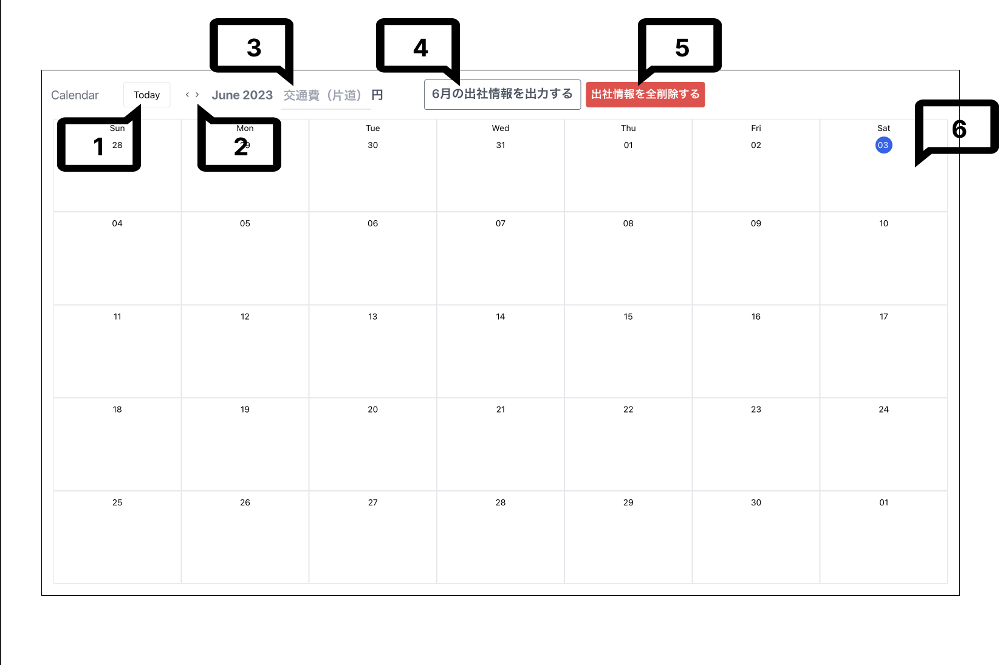
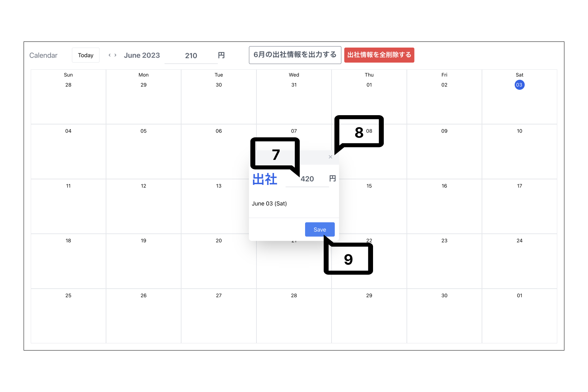
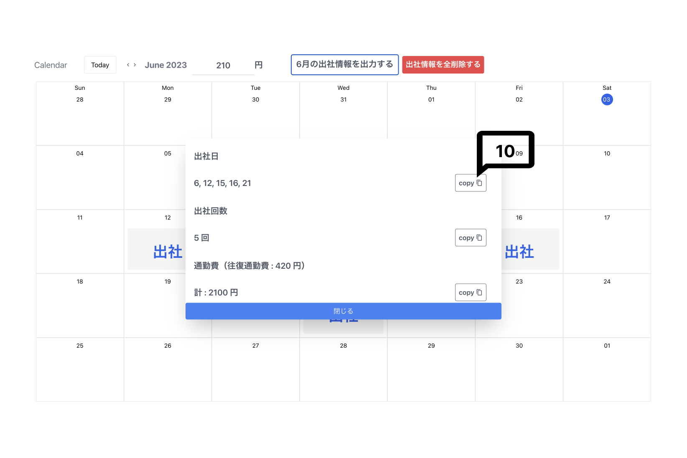
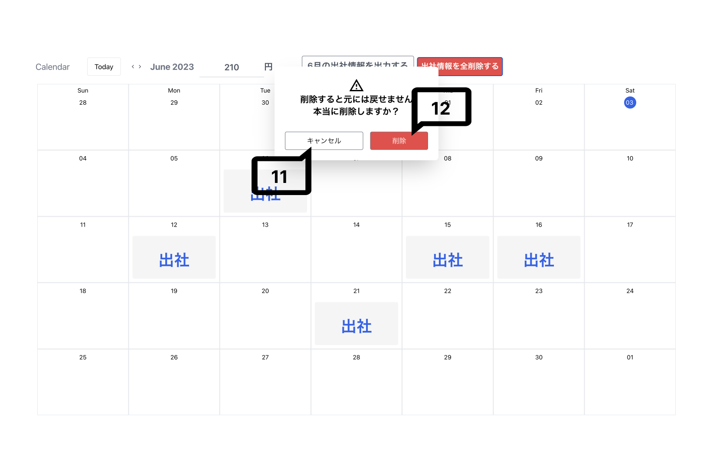
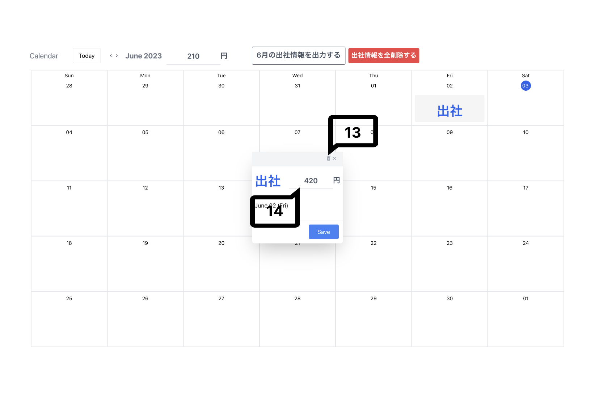

# 本アプリケーションについて
本アプリケーションは出社した際の通勤費の入力をスマートに行うのを目的に作成しました．

## 実際のサイト

## 画面構成について
### 基本的な画面構成です．

1. 今日の日付に移動します．今日の日付には色がついています．
2. 月を移動できます．
3. 片道分の交通費を入力してください．何も入力しなければ0円となります．
4. 表示月の出社情報が表示されます．
5. 登録した全ての出社情報が削除されます．
6. 全ての日付で出社情報の登録ができます．

### 出社情報を登録するモーダルです．

7. 交通費が入力されます．片道分の交通費を入力していると，自動的に往復通勤費が入力されます，
8. キャンセルボタンです．
9. 出社情報を登録できます．

### 表示されている月に登録した出社情報を表示するモーダルです．

10. 入力した全ての出社情報について出力され，それぞれの項目ごとをクリップボードにコピーすることができます．

### 全ての出社情報を削除する際に表示するモーダルです．

11. キャンセルボタンです．
12. 全ての出社情報を削除します．

### 登録した出社情報を編集するモーダルです．

13. 選択した日付の出社情報を削除します．
14. 交通費を編集できます．